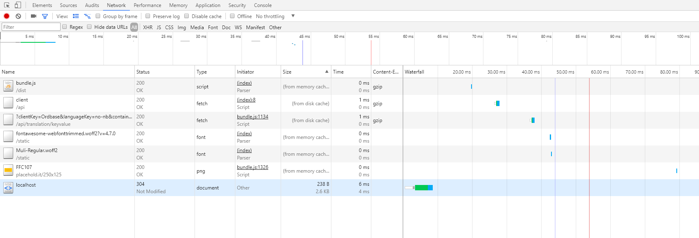

# OrdBase ASP.NET Core 1.1.2
I18n solution for FMSF


<br>

# Documentation

**Table of contents** <br>
[1. System overview](#system-overview) <br>
[2. Data model](#data-model) <br>
[3. API Reference](#api-reference) <br>
[4. Development environment](#development-environment) <br>
[5. Performance](#performance) <br>

<br>

<div id="system-overview"></div>

## 1. System overview
Last updated: 04.08.17 by Jonas Solsvik

### [Requirements.pdf](./docs/OrdBase_Bestillingsdokument.pdf)

### [System  diagram](https://arxcis.github.io/OrdBase#system-diagram)

<br>

<div id="data-model"></div>

## 2. Data model
Last updated: 04.08.17 by Jonas Solsvik
### [Data model diagram](https://arxcis.github.io/OrdBase#model-diagram)

The single most important type in Ordbase, is the Translation type.
An instance of the Translation type stores data about:
- A translation
- ...which belongs to a specific client
- ...written in a specific language
- ...is sorted into a specific container 
- ...having a unique key within the given container
- ...is considered complete or not

Here is an example of raw JSON data of type Translation. 

```json
[
  { 
      "clientKey": "fylkesmannen.no", 
      "languageKey": "no-nb", 
      "containerKey": "main_page", 
      "key": "kindergarten", 
      "text": "Barnehage", 
      "isComplete": true
  },

  { 
      "clientKey": "fylkesmannen.no", 
      "languageKey": "en", 
      "containerKey": "main_page", 
      "key": "kindergarten", 
      "text": "Kindergarten", 
      "isComplete": true
  },

  { 
      "clientKey": "fylkesmannen.no", 
      "languageKey": "ger", 
      "containerKey": "main_page", 
      "key": "kindergarten", 
      "text": "nicht fertig heute!", 
      "isComplete": false
  }
]
```
Notice how a translation instance has a composite primary key, consisting of 4 partial keys. 

<br>

**Basic types**

The Ordbase data model has 4 basic entity types, which Entity Framework maps to 4 SQL tables.

[Translation.cs](./Models/Translation.cs)
```cs
class Translation 
{
    string clientKey 
    string languageKey
    string containerKey
    string key 
    string text
    bool   isComplete
}

```

[Client.cs](./Models/Client.cs)
```cs
class Client 
{   
    string key 
    string apiKey   
    string webpageUrl?	
    string thumbnailUrl? 
}
```
The clientKey and the apikey will both be unique across clients. @question Will a Client be able to have multiple ApiKeys? Will the translations be shared across ApiKeys?
What will be shared?

[Language.cs](./Models/Language.cs)
```cs
class Language
{
    string key
    string name
}
```
It would be beneficial if all language keys are constained to follow the ISO 639-1 standard, which is used across the web. Ex: en, no, sv. For reference: [https://www.w3schools.com/tags/ref_language_codes.asp](https://www.w3schools.com/tags/ref_language_codes.asp)

[Container.cs](./Models/Container.cs)
```cs
class Container 
{
    string key
}
```
The Container type has only one attribute. This might seem redundant, but it is necessarry to create the many-to-many relationship between a Client and Containers in a SQL-database.

<br>

**Many to many relationship types**

In addition there are 2 many-to-many relationship tables, which Entity framework also maps to SQL tables

[ClientLanguage.cs](./Models/ClientLanguage.cs)
```cs
class ClientLanguage 
{
    string clientKey
    string languageKey
}
```
[ClientContainer.cs](./Models/ClientContainer.cs)
```cs
class ClientContainer
{
    string clientKey
    string containerKey
}
```

In Entity Framework .NET Framework 4.7 these tables are generated automatically, when a many-to-many relationship is detected.
Since we are using the less mature Entity Framework .NET Core 1.1.2, we have to manually declare the many-to-many types, and then link them using the EF Fluent API in the DbContext class OnModelCreating()-method:

[TranslationDb](./Models/TranslationDb.cs)
```cs
public class TranslationDb : DbContext 
{
    protected override void OnModelCreating(Modelbuilder modelBuilder) 
    {
            modelBuilder
                .Entity<ClientContainer>()
                .HasKey(cc => new 
                {
                    cc.ClientKey,
                    cc.ContainerKey,        
                });

            modelBuilder
                .Entity<ClientContainer>()
                .HasOne(cc => cc.Client)
                .WithMany(c => c.Containers)
                .HasForeignKey(cc => cc.ClientKey);

            modelBuilder
                .Entity<ClientContainer>()
                .HasOne(cc => cc.Container)
                .WithMany(c => c.Clients)
                .HasForeignKey(cc => cc.ContainerKey);
    }
}


```

<br>


**Utility types**

The Utiliity types are special types which are not stored in the database, but generated on-demand by the Ordbase service.


When editing translations in the editor, one is often interested in comparing one translation between languages.
The TranslationGroup type, combines all instances of Translation which share the same Client, Container and Key, but have 
different languages:

[TranslationGroup.cs](./Models/TranslationGroup.cs)

```cs
class TranslationGroup 
{
    class Item {
        string LanguageKey 
        string Text 
        bool   IsComplete 
    }

    string Key 
    string ClientKey 
    string ContainerKey 

    IEnumerable<Item> Items
}
```

A variation of the TranslationGroup type exists called the TranslationGroupMeta. It is indentical to TranslationGroup, except for leaving out the Text attribute. This is handy if you ONLY want the meta information about a translation group.

```cs
class TranslationGroupMeta 
{
    class Item {
        string LanguageKey 
        bool   IsComplete 
    }

    string Key 
    string ClientKey 
    string ContainerKey 

    IEnumerable<Item> Items
}
```


<br>
<div id="api-reference"></div>

## 3. API Reference
Last updated: 04.08.17 by Jonas Solsvik

This is a pretty naive implementation of a Restful API.

| Method | Description |
|-------|--------------|
|GET    | read entry   |
|POST   | create entry |
|PUT    | update entry |
|DELETE | delete entry |

@note I have learned that POST should only be used when creating new entries which have server generated URL for access. When the client decides where the new entry will be accessed, PUT should have been used. Also PATCH should be used, when only parts of a database entry is updated. When I figured this out, it was to late to change it, so this is left for future implementors. - JSolsvik 08.08.17 

### Base url
```url
https://localhost:5000/api
```

The URL convention for accessing an entry is like this:
```
api/{resource}/{optional modifier}/?{query parameters}
```


### Translation

| Method | Path                     | Parameter                                                   | Details                                     |
|--------| -------------------------|-------------------------------------------------------------| ------------------------------------------- |
| GET    | api/translation          | query { clientKey, languageKey, containerKey, translationKey } | [link](./DOCS/api/translation/GET-translation.md) |
| GET    | api/translation/keyvalue | query { clientKey, languageKey, containerKey, translationKey } | [link](./DOCS/api/translation/GET-translation-keyvalue.md) |
| GET    | api/translation/group    | query { clientKey, languageKey, containerKey }                  | [link](./DOCS/api/translation/GET-translation-group.md)  |
| GET    | api/translation/meta     | query { clientKey, languageKey, containerKey }                | [link](./DOCS/api/translation/GET-translation-meta.md)  |
| POST   | api/translation          | json { Translation   }                                      | [link](./docs/api/translation/POST-translation.md) |
| POST   | api/translation/array    | json { Translation[] }                                      | [link](./docs/api/translation/POST-translation-array.md) |
| PUT    | api/translation          | query { clientKey, languageKey, translationKey, translationKey }<br> json { Translation }   | [link](./docs/api/translation/PUT-translation.md)|
| PUT    | api/translation/group    | query { clientKey, languageKey, translationKey <br> json { Translation[] }                  | [link](./docs/api/translation/PUT-translation-array.md)|
| DELETE | api/translation          | query { clientKey, languageKey, translationKey, translationKey } |   [link](./docs/api/translation/DELETE-translation.md) |
| DELETE | api/t  ranslation/group  | query { clientKey, languageKey, translationKey }                  | [link](./docs/api/translation/DELETE-translation-group.md) |

<br>


### Client
| Method | Path                     | Parameter                   | Details                        |
|--------| -------------------------|---------------------------- | ------------------------------ |
| GET    | api/client               | query { clientKey }         | [link](docs/api/client/GET-client.md)    |
| POST   | api/client               | json { Client   }           | [link](docs/api/client/POST-client.md)    |   
| PUT    | api/client               | query { clientKey } <br> json { Client   }     | [link](docs/api/client/PUT-client.md)    |  
| DELETE | api/client               | query { clientKey }         | [link](docs/api/client/DELETE-client.md)    | 

<br>


### Language
| Method | Path                 | Parameter                   | Details                                     |
|--------| ------------------   | --------------------------- | ------------------------------------------- |
| GET    | api/language         | query { languageKey }       | [link](docs/api/language/GET-language.md)
| GET    | api/language/active  | query { clientKey   }       | [link](docs/api/language/GET-language-active.md)
| POST   | api/language         | json  { Language    }       | [link](docs/api/language/POST-language.md)
| POST   | api/language/active  | query { clientKey   } <br> json  { Language[]  }       | [link](docs/api/language/POST-language-active.md)

<br>

### Container

| Method | Path                   | Parameter              | Details                         |
|--------| ---------------------- | ---------------------- | ------------------------------- |
| GET    | api/container          | query { containerKey } | [link](docs/api/container/GET-container.md)
| GET    | api/container/nonempty | query { clientKey }    | [link](docs/api/container/GET-container-nonempty.md)
| GET    | api/container/active   | query { clientKey }    | [link](docs/api/container/GET-container-active.md)
| POST   | api/container/active   | query { clientKey   } <br> json { Container[] }  | [link](docs/api/container/POST-container-active.md)

<br>
<div id="development-environment"></div>

## 4. Development environment
Last updated: 08.08.17 by Jonas Solsvik

<br>

### Back-end
#### .NET Command Line Tools
Dependencies for the back-end are generally manged through the .NET Command line Tool:
```
$ dotnet --version
1.0.4
```

#### ASP.NET Core 1.1 - WebAPI Framework
To create an empty project based on this framework:
```
$ dotnet new webapi --framework netcoreapp1.1
```

#### .NET Core Nuget packages
The Nuget packages are documented in  [OrdBaseCore.csproj](./OrdBaseCore.csproj).

To pull in all missing packages to a project based on the .csproj-file run:
```bash
$ dotnet restore 
```

#### Kestrel Web Server
While beiing in the same directory as [Program.cs](./Program.cs) run:
```
$ dotnet run
```

#### Entity Framework - migrations
Based on the configuration of [TranslationDb.cs](./Models/TranslationDb.cs) you can migrate the current data model using:
```
$ dotnet ef migrations add my_migration
```
EF outputs the migration files in [Migrations/](./Migrations/)


#### Entity Framework - database
To update your database based on the newly created migrations run:
```
$ dotnet ef database update
```
Sometimes it is necesarry to drop the existing database:
```
$ dotnet ef database drop
```
Make sure your [appsettings.json](./appsettings.demo.json) has the correct connection string:
```json
"ConnectionStrings": {
    "MicrosoftSQLProvider": "Data Source=.\\SQLEXPRESS;Initial Catalog=OrdBase.Models.TranslationDb;Integrated Security=True; MultipleActiveResultSets=true;"
}
```

<br>

### Front-end
#### Command Line Tools
For the front-end 2 CLT's are used:
```
$ npm --version
5.0.3
```
```
$ webpack --version
3.1.0
```

#### *npm* packages
To pull in missing *npm* package dependencies documented in [package.json](./wwwroot/package.json) file run:
```
$ npm install
```

#### *webpack* bundle
Webpack bundles all *.js* and *.html* into a single [bundle.js](./wwwroot/bundle.demo.js) using es2016 import statements:
```javascript
import { html } from './header.html'
```

Webpack is configured in the [webpack.config.js](./wwwroot/webpack.config.js). To bundle just run:
```
$ webpack
```

### Misc
#### Git Version control
Configure which files should be ignored in the [.gitignore](.gitignore)
```
$ git --version
git version 2.10.2.windows.1
```

#### Editor
The development environment is editor-agnostic, but VS Code is highly recommended.
To open a project in VS Code run:
```
$ code .
``` 

<br>
<div id="performance"></div>


## 5. Performance
Last updated: 10.08.17 by Jonas Solsvik

<br>

### Caching

**Discussion**

Since Ordbase is mostly serving translations which should not change much over time, there is great opportunity to exploit caching in every way possible. Initially it was suggested to build caching mechanisms for other services talking to Ordbase, aswell as in-browser caching mechanisms. 

After some consideration, it seems like using the HTTP Protocol built in caching-mechanisms, is a better route to walk first. As long as we just use the protocol, we do not have to build any caching mechanisms ourselves, and just let the network do the work for us. - JSolsvik 10.08.17

ASP.NET Core supports this really well. In Startup.cs we do:
```cs 
services.AddMvc((options) => {
    options.CacheProfiles.Add("api_cache", new CacheProfile() {  
        Duration = 60 * 60 * 24,  
            Location = ResponseCacheLocation.Any  
    });
});
```

We can now use this cache profile in the Controlllers
```cs

[ResponseCache(CacheProfileName="api_cache")]  
[HttpGet("api/translation/keyvalue")]
public IEnumerable<KeyValuePair<string,string>> GetKeyValue([FromQuery] TranslationQuery query)
{
    return _translationRepo.GetKeyValue(query); 
}
``` 

To also make sure that bundle.js is cacheable by the browser, we have to enable caching for static files:
```cs
app.UseStaticFiles(new StaticFileOptions  
{
    OnPrepareResponse = ctx =>
    {
        const int durationInSeconds = 60 * 60 * 24;
        ctx.Context.Response.Headers[HeaderNames.CacheControl] = "public,max-age=" + durationInSeconds;
    }
});
```

The result is this beauty here:


Read blog post about it [here](http://www.c-sharpcorner.com/article/response-caching-in-asp-net-core/);

<br>

### Database Indexing

**Discussion**

They way the Translation-table is laid out, has big implications for how fast it will be to retrieve data from it. In every-day use it seems like the most frequest request to Ordbase will be to fetch an entire container of translations. If we follow the principle of *optimize for the common case*, we should make sure that the ClientKey, LanguageKey and ContainerKey, are indexed in such a way that makes retrieving an entire container of translations becomes as fast as possible. We should not care about potential slowdowns of other requests, as they will happen several orders of magnitudes less frequently. - JSolsvik 10.08.17


<br>

### Reducing amount of requests

**Discussion**

By bundling all javascript together in a Bundle.js using *webpack*, we can reduce the amount of requests that has to be made tremendously. Also inlining the shared CSS into index.html. The most important part of reducing amount of request, is to reduce the amount needed before the page can be fully drawn. Everything that is not needed until later in the user experience, can be post-poned. - JSolsvik 10.08.17


<br>

**Discussion**

### Reducing transmitted data

**Discussion**

In regards to serving Translations to other services, Ordbase serves a key-value-pair format for the common-case, namely fetching translations on a specific client-language-container. This will gretly reduce amount of data transmitted.

In regards to the administrator front-end for Ordbase, the amount of data can be reduced by ripping out unecessarry frameworks and libraries. 

**Font-awesome stats**

Example by clearing out all unused icons in the Font-Awesome.css and Font-Awesome.woff2 files, the size of these files reduced from 31kB -> 1kB and 76kB -> 1.3kB respectively.  A 46x reduction in size, just on optimizing the Font-awesome library.


**Bundle.js stats**

Minifying using:
```
uglifyjs bundle.js -c -m -o bundle.min.js 
```
..reduced from 112kb -> 47kB,  a 2.38x improvement


GZipping Bundle.js, reduced data size from 47kB -> 9.7kB. a 4.8x improvement = 11x in total

